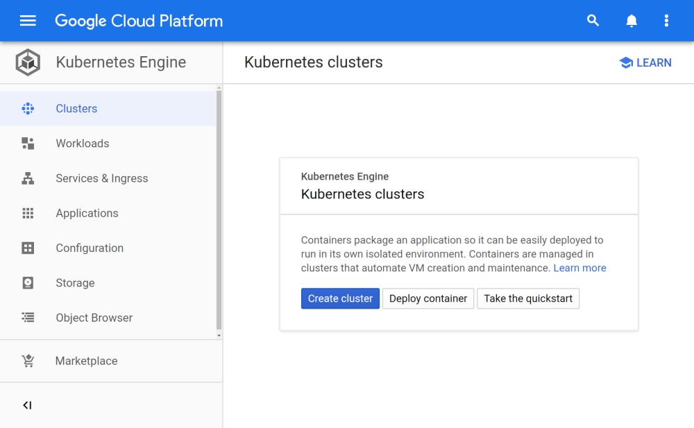
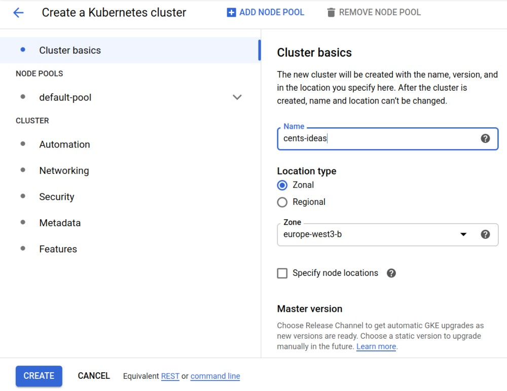
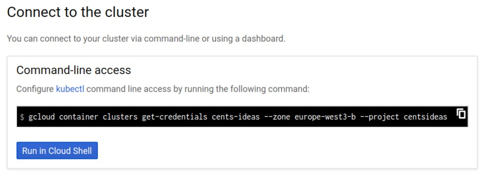
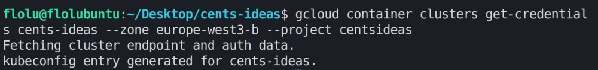
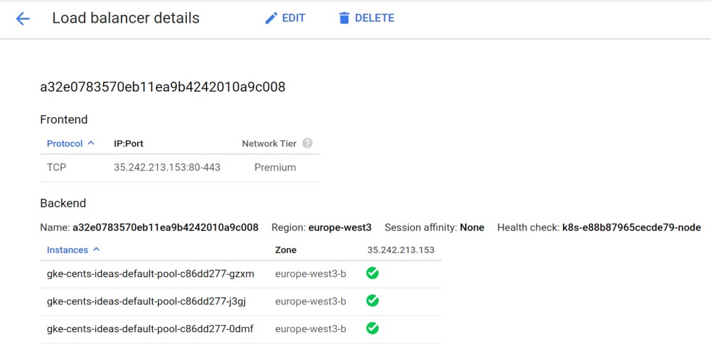
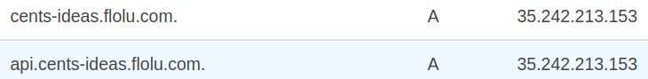
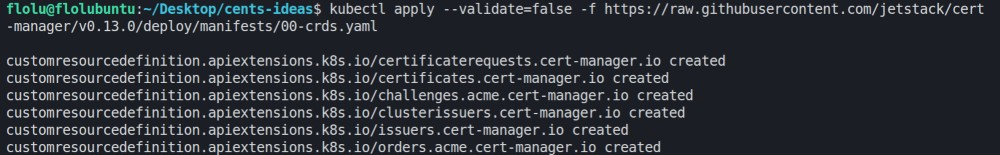
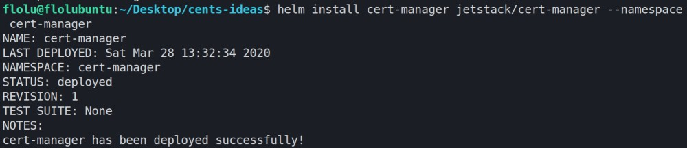

# [CENTS](https://www.thefastlaneforum.com/community/threads/the-cents-business-commandments-for-entrepreneurs.81090/) Ideas

# Description

This is a project with the purpose of learning the architecture of complex web applications. The main goals can be seen in the table below. CENTS Ideas is going to be a website to share, review and discover business ideas. The concept of CENTS (⚙ Control 🔓 Entry 🙏 Need ⏳ Time 🌍 Scale) was initially introduced by [MJ DeMarco](http://www.mjdemarco.com/).

# Goals

## Essential

| Requirement       | Keywords                               | Status |
| ----------------- | -------------------------------------- | ------ |
| Event sourcing    | event-driven, commands, message broker | ✅     |
| Deployment        | ci, cd, build automation, bazel        | ✅     |
| Testing           | unit Tests, integration Tests          | ✔️     |
| Microservices     | small services, docker                 | ✔️     |
| Kubernetes        | container orchestration                | ✅     |
| Database(s)       | data storage, event store              | ✅     |
| File storage      | blob storage                           | ❌     |
| Redux frontend    | reactive, actions, effects             | ✅     |
| GDPR              | legal, privacy                         | ❌     |
| SEO               | server side rendering, marketing       | ❌     |
| Monorepo          | all packages and services in one repo  | ✔️     |
| Typescript        | types everywhere!                      | ✔️     |
| Local development | hot reload, docker-compose, vscode     | ✔️     |
| Git flow          | branching, releases, rebasing          | ✔️     |
| Gateway           | discovery, entry point, auth           | ✔️     |
| Static pages      | homepage, static content               | ❌     |
| Search            | indexing, realtime search              | ❌     |
| Authentication    | passwordless, 2f auth, google login    | ❌     |
| Admin panel       | monitoring, event handling, logs       | ❌     |
| Backups           | automatic, manual, restore             | ❌     |
| Realtime          | some kind of realtime integration      | ❌     |
| User Interface    | modern, unique, reusable               | ❌     |

### Status

✔️ Completely implemented

✅ Implemented in certain parts

⏳ Figuring out how to implement

❌ Not (yet) implemented

# Development

- `yarn` to install all necessary dependencies for local development
- `yarn dev` to start all backend services locally (gateway is available under http://localhost:3000)
- `yarn client:start` to start the frontend application (live url is printed in logs)
- `yarn test` to run all unit tests

## Requirements

- Yarn
- Docker-Compose
- NodeJs

# Deployment

## 1. Setup your Kubernetes Cluster

- Head to [Google Kubernetes Engine](https://console.cloud.google.com/kubernetes) create a cluster
  
- Give your cluster a name and configure a zone or region. All other settings can be left untouched. Then hit "Create"
  
- While the cluster is creating you can install [Google Cloud SDK](https://cloud.google.com/sdk/install) and [kubectl](https://kubernetes.io/docs/tasks/tools/install-kubectl/)
- Select your created cluster and choose "Connect". You can just copy the command and paste it into your terminal.
  
- This command should be successful if you have `kubectl` installed
  

## 2. Setup [Helm](https://helm.sh/)

> To simplify the next step we will use Helm, a package manager for Kubernetes

- Install [Helm](https://helm.sh/docs/intro/install/)
- Add chart repositories
  ```
  helm repo add stable https://kubernetes-charts.storage.googleapis.com/
  helm repo add jetstack https://charts.jetstack.io/
  helm repo update
  ```

## 3. Create an [NGINX Ingress](https://github.com/kubernetes/ingress-nginx)

> ingress-nginx is an Ingress controller for Kubernetes using NGINX as a reverse proxy and load balancer

- Configure permissions
  ```
  kubectl create clusterrolebinding cluster-admin-binding --clusterrole cluster-admin --user $(gcloud config get-value account)
  ```
- Install nginx-ingress
  ```
  helm install nginx-ingress stable/nginx-ingress
  ```
  > It may take a few minutes for the LoadBalancer IP to be available
- Head to your [Load Balancers](https://console.cloud.google.com/net-services/loadbalancing/loadBalancers/list) and select the newly created Load Balancer. There you will find the IP address. (In my case it's: `35.242.213.153`)
  
- In the settings of your domain name provider add two "A" records, that point to the Load Balancer's IP address. One for the backend API and one for the web application:
  

## 4. Setup [Cert Manager](https://github.com/helm/charts/tree/master/stable/cert-manager)

> cert-manager is a Kubernetes addon to automate the management and issuance of TLS certificates from various issuing sources.

- Install mandatory configuration for cert-manager
  ```
  kubectl apply --validate=false -f https://raw.githubusercontent.com/jetstack/cert-manager/v0.13.0/deploy/manifests/00-crds.yaml
  ```
  
- It's recommended to create a namespace for cert-manager
  ```
  kubectl create namespace cert-manager
  ```
- Install cert-manager via helm
  ```
  helm install cert-manager jetstack/cert-manager --namespace cert-manager
  ```
  
- By now you should already have a few workloads and services in your cluster
- Enter your email address for the issuing the ssl certificates in `kubernetes/certificate-issuer.yaml`
  ```
  apiVersion: cert-manager.io/v1alpha2
  kind: ClusterIssuer
  metadata:
    name: letsencrypt
  spec:
    acme:
      server: https://acme-v02.api.letsencrypt.org/directory
  ⮕   email: YOUR@EMAIL.HERE
      privateKeySecretRef:
        name: letsencrypt-private-key
      solvers:
        - http01:
            ingress:
              class: nginx
  ```
- Configure the Ingress to use your domains in `kubernetes/ingress.yaml`
  ```
  apiVersion: extensions/v1beta1
  kind: Ingress
  metadata:
    name: cents-ideas-ingress
    annotations:
      kubernetes.io/tls-acme: 'true'
      kubernetes.io/ingress.class: 'nginx'
      cert-manager.io/cluster-issuer: letsencrypt
  spec:
    tls:
      - hosts:
  ⮕       - cents-ideas.flolu.com
  ⮕       - api.cents-ideas.flolu.com
        secretName: cents-ideas-tls
    rules:
  ⮕   - host: api.cents-ideas.flolu.com
        http:
          paths:
            - backend:
                serviceName: cents-ideas-gateway
                servicePort: 3000
   ⮕  - host: cents-ideas.flolu.com
        http:
          paths:
            - backend:
                serviceName: cents-ideas-client
                servicePort: 8080
  ```
  - In `kubernetes/config.yaml`, you'll also need to change the `API_URL` to your domain
  ```
  data:
  ⮕  API_URL: https://cents-ideas-api.flolu.com
  ```

## 5. Deploy services

- In `WORKSPACE` enter your Google project name, the zone or region of the cluster and your cluster name
  ```
  k8s_defaults(
      name = "k8s_deploy",
      cluster = "_".join([
          "gke",
  ⮕       "centsideas",
  ⮕       "europe-west3-b",
  ⮕       "cents-ideas",
      ]),
      kind = "deployment",
  )
  ```
- **TODO:** Add variable for docker image urls!
- Now it's finally time to deploy the configurations and all `./services`.
  ```
  yarn deploy
  ```
- Depending on your workstation and your internet speed, this step may take a few minutes. Bazel will take the source code and create Docker images from it. Those docker images will then be uploaded the Google Container Registry. Afterwards all deployments will be applied to the Kubernetes cluster, which then runs the Docker images.
- That's it. You should now be able to visit your domains. In my case https://cents-ideas.flolu.com for the web application and https://api.cents-ideas.flolu.com for the backend API

## Git Flow

**Read [this](https://www.atlassian.com/git/tutorials/comparing-workflows/gitflow-workflow) for more detail**

**Creating a feature branch**

```
git checkout develop
git checkout -b <name-of-feature-branch>
```

**Finishing a feature branch**

```
git checkout develop
git merge <name-of-feature-branch>
```

**Release branches**

```
git checkout develop
git checkout -b release/0.1.0
# release work
git checkout master
git merge release/0.1.0
```

**Hotfix branches**

```
git checkout master
git checkout -b <name-of-hotfix-branch>
git checkout master
git merge <name-of-hotfix-branch>
git checkout develop
git merge <name-of-hotfix-branch>
git branch -D <name-of-hotfix-branch>
```
